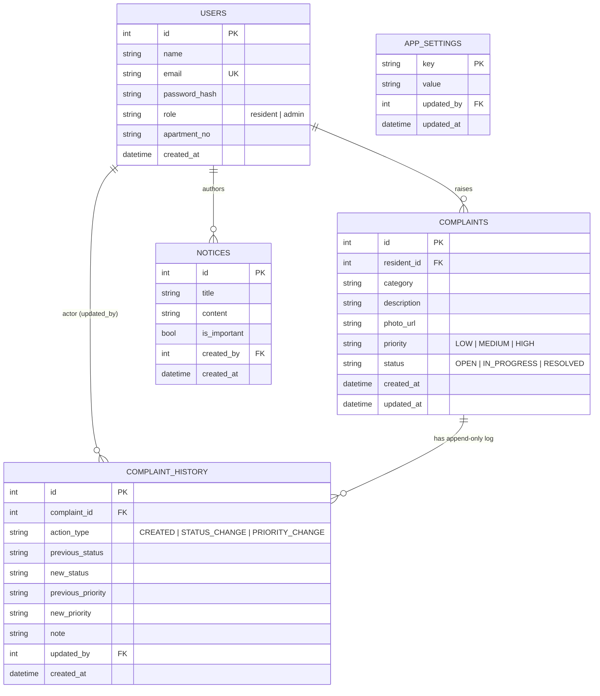

# Society Hub — Maintenance & Operations Management Platform

A full-stack implementation of the resident/admin complaint-tracking and
notice-board system described in the design spec, built to the **standout**
bar on every evaluation axis rather than the average one.

```
society-hub/
├── backend/                  Node.js + Express API (SQLite)
│   ├── config/db.js          DB connection singleton, boots schema.sql on start
│   ├── db/schema.sql          Full relational schema + comments
│   ├── controllers/          Business logic per resource
│   ├── routes/                Express routers, RBAC applied per-route
│   ├── middleware/            auth (JWT + RBAC), upload (multer), errorHandler
│   ├── services/              overdueService (dynamic query), emailService (async)
│   ├── utils/                 asyncHandler, ApiError
│   ├── seed.js                 Demo admin + 2 residents + sample complaints
│   ├── .env.example
│   └── server.js
├── frontend/                  React SPA (no bundler required)
│   ├── index.html              Loads React/Babel from CDN, mounts app.js
│   ├── css/styles.css          Design system: colors, type scale, badges
│   └── js/{api.js, app.js}     API client + all screens (A–E from the spec)
└── README.md                   (this file)
```

## 1. Quick start

### Backend
```bash
cd backend
cp .env.example .env       # edit JWT_SECRET at minimum
npm install
npm run seed                # creates demo admin + residents + sample data
npm start                   # http://localhost:4000
```

### Frontend
The frontend is plain static files — no bundler needed for local dev.
```bash
cd frontend
npx serve .                 # or: python3 -m http.server 5173
```
Open the printed URL. If your API isn't on `http://localhost:4000`, set
`window.SOCIETY_HUB_API_BASE` in `index.html` before `api.js` loads.

**Demo accounts** (created by `npm run seed`):
| Role     | Email                     | Password       |
|----------|---------------------------|----------------|
| Admin    | admin@societyhub.local    | Admin@12345    |
| Resident | jane@societyhub.local     | Resident@123   |
| Resident | raj@societyhub.local      | Resident@123   |

## 2. Entity-relationship diagram



`overdue` is deliberately **not a column anywhere** — see §3.2.

## 3. Design write-up: how each requirement was met

### 3.1 Data integrity & audit log — immutable history, not an overwrite
`complaints.status`/`priority` are mutable (they represent *current* state),
but every transition also inserts a row into `complaint_history`
(`backend/db/schema.sql`). The two writes are never independent:

```js
// controllers/complaintController.js
const applyStatusChange = db.transaction((complaintId, newStatus, adminId, note) => {
  // 1. UPDATE complaints SET status = ...
  // 2. INSERT INTO complaint_history (...)
  // both committed by better-sqlite3's db.transaction(), or neither is.
});
```
`complaint_history` is insert-only — no controller ever issues an `UPDATE`
or `DELETE` against it. The timeline UI (`TimelineModal` in `app.js`) reads
straight from this table, so what the resident sees is exactly the audit
trail, not a reconstruction.

### 3.2 Overdue logic — dynamic, DB-level, admin-configurable
There is no `is_overdue` column and no cron job. `overdueService.js`
builds a bound-parameter SQL fragment:

```sql
(status != 'RESOLVED' AND (julianday('now') - julianday(created_at)) > ?)
```
The `?` is the threshold read from `app_settings.overdue_threshold_days`,
editable by an admin via `PUT /api/admin/settings/overdue-threshold`
(exposed in the Admin dashboard as the "Overdue after ___ day(s)" control).
Because the flag is computed on every query, changing the threshold
re-classifies the entire table immediately — no migration, no stale cache.
The admin complaints list (`GET /api/complaints`) also **sorts overdue rows
to the top at the SQL level** (`ORDER BY is_overdue DESC, ...`), not via a
client-side re-sort.

### 3.3 Role-based security — enforced on the server, not the DOM
`middleware/auth.js` exports `authenticate` (verifies the JWT) and
`authorize(...roles)` (checks the token's `role` claim). Every
admin-only route — status/priority updates, notice creation, settings,
metrics, the full complaint list — is wrapped in `authorize('admin')` at
the router level (`routes/*.js`), independent of anything the frontend
renders. A resident's token simply cannot pass `authorize('admin')`,
whether the request comes from the SPA, curl, or Postman. Frontend role
checks (`AppInner` picking `AdminDashboard` vs `ResidentDashboard`) are a
UX convenience only; they are not treated as a security boundary.
Passwords are hashed with bcrypt (10 rounds); public self-registration is
hard-coded to `role = 'resident'` — there is no client-controllable field
that can mint an admin account.

### 3.4 Edge cases & error handling
- **Centralized errors**: every controller throws `ApiError(status, message)`;
  `middleware/errorHandler.js` is the single place that turns any error
  (validation, `better-sqlite3` constraint violations, multer upload
  errors, 404s) into a consistent `{ error: { message } }` JSON body the
  frontend renders as a toast — never a blank page or a stack trace.
- **Upload failures preserve the draft**: `NewComplaintModal` catches
  submit errors without clearing `description`/`category`/the selected
  file, so a dropped connection mid-upload costs the resident a retry
  click, not their typed text (matches the spec's explicit edge case).
- **Empty states**: `EmptyState` component is used for zero-result
  complaint lists, empty notice boards, and empty admin filters instead of
  a bare table/blank container.
- **Double-submit protection**: submit buttons disable and show an inline
  spinner (`disabled={submitting}`) for complaint creation, notice
  creation, and login/register.

### 3.5 Asynchronous, non-blocking notifications
`services/emailService.js` exposes `notifyImportantNotice` /
`notifyComplaintStatusChange`, both of which call `send()` **without an
`await`** from the controllers:

```js
// noticeController.js
res.status(201).json({ notice });        // admin's response goes out first
if (important) notifyImportantNotice(notice, residents); // fire-and-forget
```
`send()` internally catches its own errors, so a slow or failing mail
transport can never throw into the request/response cycle or delay the
API response. Swapping `EMAIL_TRANSPORT=console` for `EMAIL_TRANSPORT=smtp`
(with `nodemailer`) in `.env` is a one-line config change — no controller
code changes.

### 3.6 Code structure
Strict separation: `routes/` (HTTP + RBAC wiring) → `controllers/`
(request/response + validation) → `services/` (reusable business logic:
overdue math, email) → `config/db.js` (single DB connection). No SQL lives
in routes; no HTTP concerns leak into services. `.env.example`, `seed.js`,
the ER diagram above, and this write-up ship alongside the code rather
than a bare `npm start` README.

## 4. API summary

| Method | Path | Auth | Notes |
|---|---|---|---|
| POST | `/api/auth/register` | public | residents only |
| POST | `/api/auth/login` | public | |
| GET  | `/api/auth/me` | any | |
| POST | `/api/complaints` | resident | multipart, `photo` optional |
| GET  | `/api/complaints/mine` | resident | `?status=&category=` |
| GET  | `/api/complaints` | admin | `?status=&category=&priority=&search=`, overdue-sorted |
| GET  | `/api/complaints/:id` | owner or admin | complaint + full timeline |
| PATCH| `/api/complaints/:id/status` | admin | logs `complaint_history`, emails resident |
| PATCH| `/api/complaints/:id/priority` | admin | logs `complaint_history` |
| GET  | `/api/complaints/metrics` | admin | dashboard counters |
| GET  | `/api/notices` | any | pinned-first |
| POST | `/api/notices` | admin | `is_important` triggers async email fanout |
| GET/PUT | `/api/admin/settings/overdue-threshold` | admin | drives §3.2 |

Versioned clients should use the equivalent `/api/v1/...` paths. Legacy `/api/...`
paths remain available during the transition. Complaint creation and status changes
also publish authenticated Socket.io events (`complaint:created` to `admin_room`
and `complaint:updated` to the owning resident room). Admins can manage the user
directory through `GET /api/v1/admin/users` and `PATCH /api/v1/admin/users/:id/role`.

## 5. What's intentionally out of scope
Real SMTP credentials, file storage on S3/cloud (uploads are local disk,
swap `middleware/upload.js`'s `diskStorage` for `multer-s3` in production),
and a production Vite build for the frontend (the CDN/Babel-in-browser
setup is meant for local dev/demo speed, per `frontend/index.html`).
